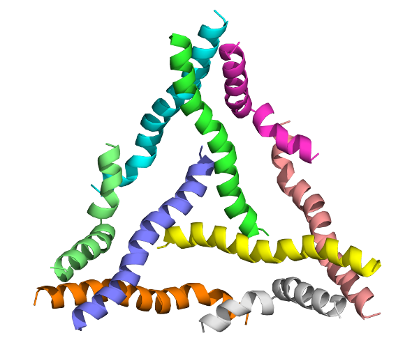

=====
worms
=====

.. image:: https://img.shields.io/pypi/v/worms.svg
        :target: https://pypi.python.org/pypi/worms

.. image:: https://img.shields.io/travis/willsheffler/worms.svg
        :target: https://travis-ci.org/willsheffler/worms

.. image:: https://readthedocs.org/projects/worms/badge/?version=latest
        :target: https://worms.readthedocs.io/en/latest/?badge=latest
        :alt: Documentation Status

.. image:: https://pyup.io/repos/github/willsheffler/worms/shield.svg
     :target: https://pyup.io/repos/github/willsheffler/worms/
     :alt: Updates

Protein assembly design without protein interface design.

* Free software: Apache Software License 2.0
* Documentation: https://worms.readthedocs.io.

.. image:: img/worms_triangle_600.png

Features
--------

please send angry emails to willsheffler@gmail.com until there are docs here.

Credits
---------

This package was created with Cookiecutter_ and the `audreyr/cookiecutter-pypackage`_ project template.

.. _Cookiecutter: https://github.com/audreyr/cookiecutter
.. _`audreyr/cookiecutter-pypackage`: https://github.com/audreyr/cookiecutter-pypackage

